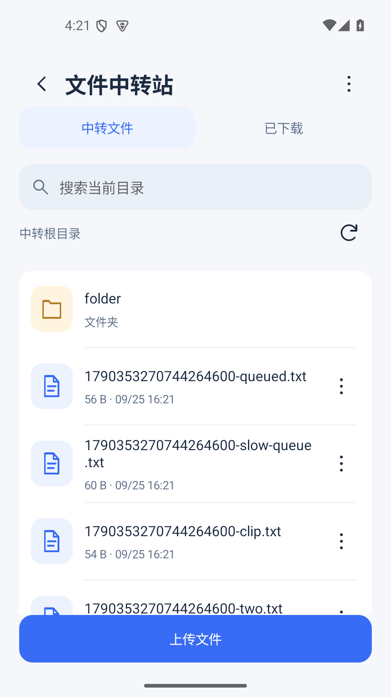
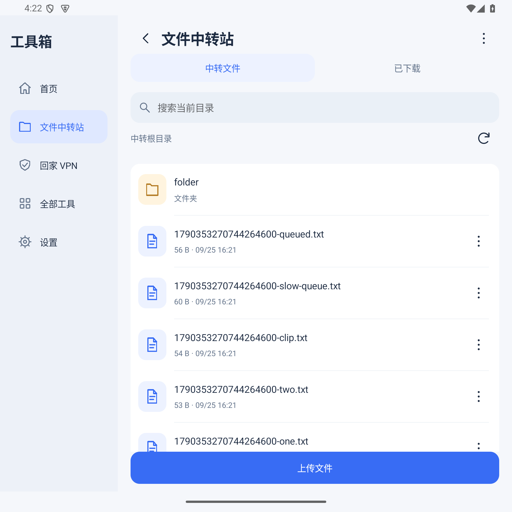

# 安卓工具箱 · AndroidToolbox

原生 Android 工具箱，参考 [WinToolbox](https://github.com/thdlrt/WinToolbox) 的工具首页、常用项、功能页与设置结构。**回家 VPN** 是第一个功能。

[下载正式 APK](https://github.com/thdlrt/AndroidToolbox/releases/latest) · [架构与扩展](docs/ARCHITECTURE.md) · [贡献指南](CONTRIBUTING.md)

 

## 功能

- 工具首页与全部工具目录，支持设置首页常用项。
- 折叠屏展开、平板与宽屏窗口自动显示左侧功能导航；窄屏使用底部导航。统一图标、卡片和文件列表，长按文件多选，常用操作更集中。
- 设置中的统一 WebDAV 连接供文件中转站、项目记账、诊断配置共用，各自使用独立目录；旧连接自动迁移。
- 项目记账：创建和归档项目组，AI报销按 50% 分摊，普通项目完整记账；支持拍照、图片/PDF/OFD 附件、按项目与日期筛选。打开应用和修改后自动合并同步，同字段并发修改保留版本并提供冲突选择。PC 支持按项目和日期导出表格，详见 [项目记账与网络诊断](docs/LEDGER.md)。
- 网络诊断：分别检查 DNS、重复 TCP 连接、TLS 证书、HTTP 状态，配置支持跨端自动同步，报告保存在本机。
- 文件中转站：从其他应用“打开方式”或“分享”直接上传文件，支持多文件队列、后台传输、搜索排序、单个/批量删除、下载到系统目录及跨应用打开/分享；已下载缓存可重复打开或清理。使用方法见 [文件中转站](docs/FILE-RELAY.md)。
- 回家 VPN：通过 fnOS 局域网桥和 FN Connect 访问局域网，或使用家中 IPv4 TCP 出口。
- Android Keystore 加密记住密码，VPN 前台服务在离开页面后继续运行。
- 设置页检查 GitHub 正式版，一键下载、校验并唤起系统安装。首次需允许安装 APK，每次仍需系统确认。
- 保留旧客户端包名和发行签名，可从 LanBridge Android 0.1.x 覆盖升级并保留配置。

Android 10+；APK 包含 arm64-v8a、armeabi-v7a、x86_64、x86。新安装需要自行填写 NAS 地址和管理员账号。

## VPN 前提与范围

NAS 必须安装并开启配套的「局域网桥」应用（协议 `lanbridge-tcp-v1`，0.4.1+ 推荐）。这是自定义客户端协议，不是仅有 FN Connect 就能连接的通用 VPN。服务端目前不在此仓库内。

仅回家模式接管服务端允许的私有 IPv4 网段，其余直连；全局模式接管 IPv4 TCP，使用映射 DNS 交给 NAS 解析。**普通 UDP、QUIC、ICMP 和 IPv6 转发不支持**，无法替代完整 UDP VPN。全局模式捕获并拒绝 IPv6，不自动泄漏为直连。两步验证暂不支持。

应用本身排除在 VPN 之外，出口 Socket 受保护，避免隧道递归。凭据保存在本机，Cookie 留在内存；不会上传给 GitHub。全局速度仍受 FN Connect 和家庭出口限制。

## 构建

Windows、JDK 21+、Python 3.12+、PowerShell 7。Android SDK/Gradle/NDK 按脚本固定版本下载到项目 `.build`，首次准备需较多磁盘空间和网络。

```powershell
$env:JAVA_HOME = '你的 JDK 目录'
python scripts/bootstrap.py
./scripts/build-native.ps1
./build.ps1 -DebugOnly
```

开发机项目及所有 Android 缓存均放 E 盘。`env.ps1` 只修改当前进程环境，不修改全局配置。默认 Java 位置可被 `JAVA_HOME` 覆盖。

正式签名构建执行 `./build.ps1`，输出 `outputs/AndroidToolbox-X.Y.Z.apk` 与 `.sha256`。首次会创建本机签名，密钥在 `.signing/lanbridge.jks`，密码使用 Windows DPAPI 保存。官方维护者沿用迁移的签名密钥；自行生成的签名不能覆盖官方安装。签名目录、缓存、用户配置和项目知识身份文件均排除在 Git 之外。

## 更新与发布

设置 → 检查更新 → 下载并更新。客户端只接受本仓库正式 Release 的 APK 和校验文件；下载后验证 SHA-256、包名、递增版本号、版本名和签名证书，再打开 Android 安装器。下载失败保留当前应用。

维护者提高 `app/build.gradle` 的 `versionCode` 和 `versionName`，运行构建与测试，再创建 `vX.Y.Z` 标签及正式 Release，上传 APK 和同名 `.sha256`。签名密钥不交给 CI。GitHub Actions 仅构建调试版和运行测试。

## 验证

`build.ps1` 会运行本地单元测试与协议集成测试，包括认证、Cookie 隔离、SOCKS 数据传输、更新版本比较、资产来源和校验文件拒绝路径。真实 NAS 测试默认跳过，仅在显式提供 `LANBRIDGE_LIVE_ORIGIN`、`LANBRIDGE_LIVE_USER`、`LANBRIDGE_LIVE_PASSWORD`、`LANBRIDGE_LIVE_TARGET`（SSH 目标）时执行。

当前发布验证记录见 [VALIDATION.md](docs/VALIDATION.md)。不能把构建通过等同于所有手机后台保活与所有网络均可用。

## 开源许可

项目代码 MIT；hev-socks5-tunnel 2.17.1（MIT）、lwIP（BSD）、libyaml（MIT）、OkHttp/Okio/Kotlin（Apache-2.0）等许可保留在 `app/src/main/assets/licenses/`，设置页可查看。本项目是独立客户端，与飞牛官方无隶属关系。
